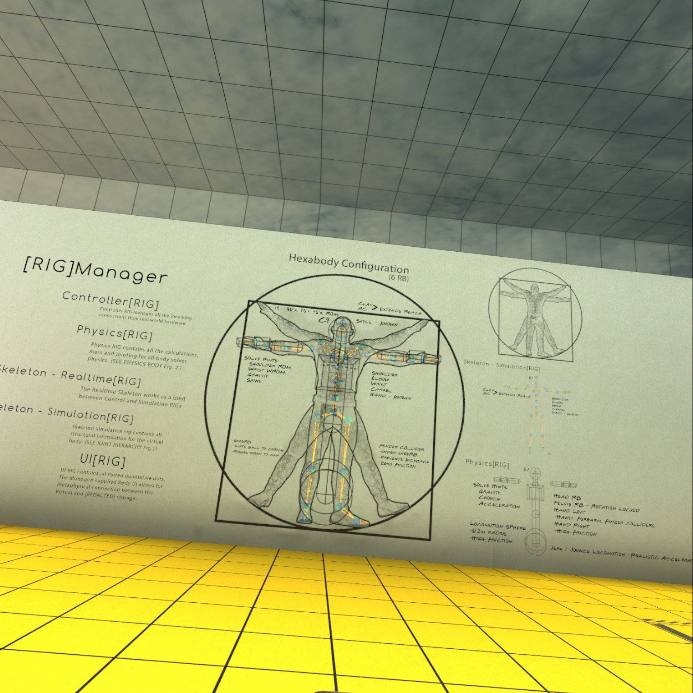

# A-Frame Hexabody

This is my attempt to port the Hexabody character controller from Boneworks into WebXR using A-Frame and [PhysX](https://github.com/msub2/PhysX).

Right now the locomotion sphere and fender portions are working more or less as expected, but more work is required to get things like hands, crouching, and jumping working properly as well. This is being largely adapted from tutorials provided by Tomaso on YouTube: you can check out his channel [here](https://www.youtube.com/channel/UC8fssZ1EapXnS2NZGBoKJcA).

## Disclaimer

This project has no affiliation with the [HexaBody VR Player Controller](https://assetstore.unity.com/packages/tools/physics/hexabody-vr-player-controller-185521) on the Unity Asset Store. I have not referenced the code of this asset in this implementation.
